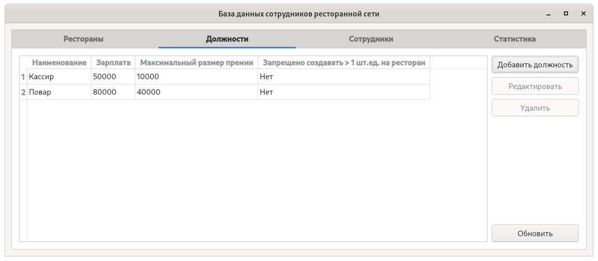
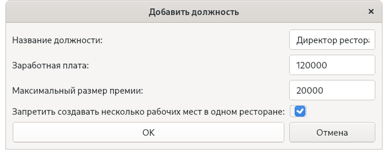
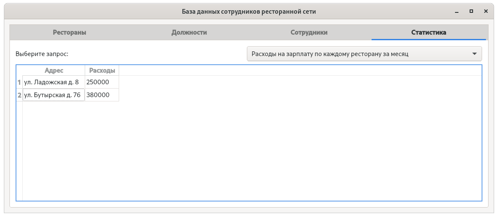

# База данных сети ресторанов

Клиентская программа, написанная на C++ с использованием библиотеки Qt 5-й версии, для работы с базой данной, хранящей информацию о адресах ресторанов, должностях, зарплатах, премиях, и выводящая соответствующую статистику.

Использовался СУБД PostgreSQL 12.3.

## Создание базы данных

Перед использованием, необходимо создать таблицы с помощью следующих команд:

```sql
CREATE TABLE positions (
        position_id     integer     PRIMARY KEY GENERATED ALWAYS AS IDENTITY,
        title           varchar(80) NOT NULL UNIQUE,
        salary          real        NOT NULL CHECK (salary > 0),
        max_award       real        NOT NULL CHECK (max_award > 0),
        only_one        boolean     NOT NULL
        );

CREATE TABLE restaurants (
        restaurant_id   integer     PRIMARY KEY GENERATED ALWAYS AS IDENTITY,
        address         varchar(80) NOT NULL UNIQUE
        );

CREATE TABLE staff (
        employee_id     integer     PRIMARY KEY GENERATED ALWAYS AS IDENTITY,
        first_name      varchar(80) NOT NULL,
        last_name       varchar(80) NOT NULL,
        restaurant_id   int         NOT NULL REFERENCES restaurants,
        position_id     int         NOT NULL REFERENCES positions
        );
```

## Подключение к базе данных

При запуске программа запрашивает адрес хоста, номер порта, название базы данных, имя пользователя и пароль:


## Основное окно

В главном окне программы есть 4 вкладки. Во вкладках "Рестораны", "Должности", "Сотрудники", "Статистика" отображается соответствующая информация. 



Программа поддерживает не только отображение, но и редактирование информации:



Во вкладке "Статистика" можно выбрать соответствующий оцениваемый параметр:



Вычисление статистики осуществляется с помощью SQL-запросов.

**Все данные, приведенные на изображениях, являются вымышленными, любые совпадения случайны. Программа предназначена только для демонстрационных целей.**
